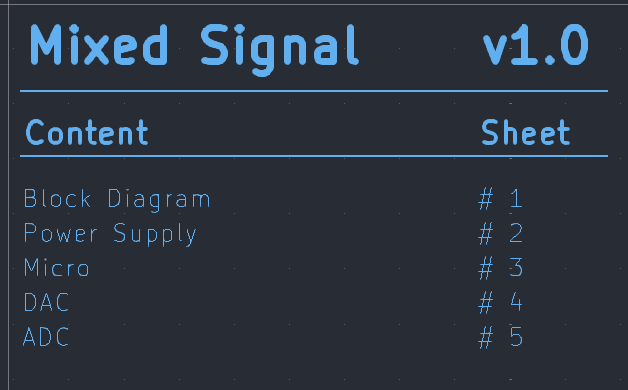

# Index Generator for KiCad

This project is a Python tool that allows you to automatically generate an index (or table of contents) for KiCad schematics. It includes options to customize font sizes, language, column spacing, and so you can tailor the index to your needs.

## What is it for?

- Facilitates the creation of a page index within a KiCad project.
- Allows adding and editing pages through a graphical interface (Tkinter).
- Generates text in the correct format for KiCad (version 8 or higher)(could works in previous version, but NOT TESTED).
- Offers the option to copy the result to the clipboard for direct pasting into KiCad.
- Enables saving the configuration and index to a `.sch` file, as well as reloading it at any time.



This is the style of the index that the script generates.

## Features

- **Simple graphical interface**: Add, edit, or delete pages using dialog boxes.
- **Font adjustment**: Change text size for the title, version, headers, and page content.
- **File saving options**:  
  - You can always overwrite the same `index_gen.sch` file (default).  
  - Or select a new file each time you generate the index.
- **Load index**: If you already have a generated index, you can load it and continue editing.
- **`config.ini` configuration file**: All default values (font sizes, language, etc.) are centralized in a `config.ini` file, making it easy to modify settings without changing the code.

## Requirements

- **Python 3.11+** (or later)(could works in previous version, but NOT TESTED).
- **Standard libraries**: `tkinter`, `configparser`, `json`, `os`, `sys`.
- **Pyperclip**: For copying text to the clipboard. You can install it with `pip install pyperclip`:
- **Tkinter**: For the graphical interface. On Linux systems, you may need to install the `python3-tk` package.

You can install **tkinter** on Debian based images using the following command:

```bash
sudo apt-get install python3-tk
```

You can install the required dependencies (pip) with:

```bash
pip install -r requirements.txt
```

## Installation and Usage

1. **Clone or download this repository** to your local machine.
2. Ensure you have satisfied the requirements.
3. If a `config.ini` file does not exist, the script will automatically create one with default values when executed.

To **run** the application:

```bash
python kicad_index_generator.py
```
```bash
python3 kicad_index_generator.py
```

*(Assuming the main file is named `kicad_index_generator.py`.)*

### Application Steps

1. **Project Name**: Fill in the field with the name you want to display in the index.  
2. **Version**: Enter the version (e.g., `v2.3`).  
3. **Column Spacing**: Adjust the horizontal spacing between the content column and the page number column (default is 110).  
4. **Language in English**: Check this box if you want the headers to appear as `Content` and `Sheet` instead of `Contenido` and `Hoja`.  
5. **Save in new file (don't overwrite)**: If checked, the application will ask where to save the index each time. Otherwise, it will use (and overwrite) the file `indice_generado.sch`.  
6. **Add Page**: Opens a dialog to add a new entry (page name and sheet number).  
7. **Generate Index**: Creates the index with the listed entries, saves it to the selected file, and copies the text to the clipboard.  
8. **Load File**: Allows you to open a previously generated `.sch` file and retrieve its pages for editing.  
9. **Adjust Text Sizes**: Opens a window where you can change the font size for the title, version, headers, and pages.

## `config.ini` Configuration File

The `config.ini` file contains the default values for the application. For example:

```ini
[DEFAULTS]
font_size_title = 10
font_size_version = 10
font_size_header = 5
font_size_page = 4
default_spacing = 150
default_language = en
save_in_new_file = false
```

- `font_size_title` / `font_size_version` / `font_size_header` / `font_size_page`: Default font sizes.  
- `default_spacing`: Default column spacing.  
- `default_language`: `es` for Spanish or `en` for English.  
- `save_in_new_file`: `true` to always save in a new file by default; `false` to overwrite.

You can edit these values without modifying the Python code. The next time you run the application, it will apply the changes from `config.ini`.

>[!TIP]
> To run it in the background without showing errors:
>
>`nohup python3 /path/kicad_index_creator.py > /dev/null 2>&1 &`
